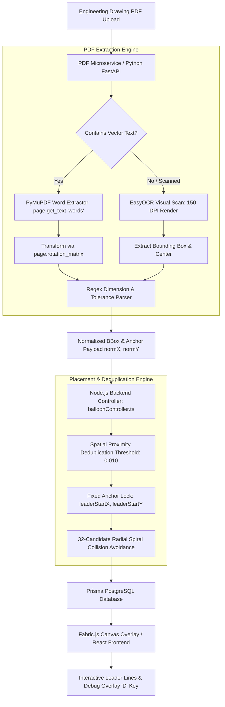

# Automated Inspection Ballooning Pipeline: Architecture & Technical Specification

## 1. Executive Summary

The **Automated Inspection Ballooning System** transforms raw 2D engineering drawings (AutoCAD vector PDFs, CAD-exported multi-sheet documents, and scanned raster PDFs) into fully ballooned, FAIR/PPAP-compliant inspection reports.

The system ensures **100% spatial precision**: every balloon's dotted leader line locks onto the exact physical dimension text (anchor coordinate), while balloon circles automatically shift into nearby white space to eliminate overlapping and clutter.

---

## 2. End-to-End System Architecture



---

## 3. Core Subsystems & Implementation Details

### Stage 1: Hybrid Extraction Engine (`pdf-service/app/services/pdf_extractor.py`)

1. **Word-Level Vector Extraction**:
   - Instead of block-level bounding boxes, PyMuPDF extracts word-level tuples `(x0, y0, x1, y1, text, block_no, line_no, word_no)`.
   - Words on the same line are grouped to reconstruct complete callout strings (e.g., `Ø50 +0.10/-0.05` or `326`).

2. **Rotated Page Coordinate Normalization**:
   - To support rotated CAD drawings (`page.rotation = 90°, 180°, 270°`), raw bounding boxes are transformed using `page.rotation_matrix`:
     $$\text{b\_rect} = \text{fitz.Rect}(x_0, y_0, x_1, y_1) \times \text{page.rotation\_matrix}$$
   - Center anchor coordinates and bounding boxes are normalized to $[0.0, 1.0]$:
     $$\text{normX} = \frac{\text{center\_x}}{\text{page.rect.width}}, \quad \text{normY} = \frac{\text{center\_y}}{\text{page.rect.height}}$$

3. **Multi-Pattern Dimension & Tolerance Parser**:
   - **Nominal Numbers**: `326`, `270`, `126`, `75`, `210`, `175`, `50`, `45`, `20`, `10`, `32`
   - **Prefixes**: Diameter (`Ø`, `⌀`, `O`), Radius (`R`), Thread (`M`), Square (`SQ`), Spherical (`SR`, `SØ`)
   - **Symmetric Tolerances**: `25 ±0.10`, `R10 ±0.05`
   - **Asymmetric Tolerances**: `25 +0.10/-0.05`, `Ø50 +0.10/-0.05`

4. **EasyOCR Visual Fallback for Scanned Drawings**:
   - Triggered automatically when vector text count is zero.
   - Operates on a 150 DPI rendered canvas with scaling capped at `max_dim = 1800` for optimal neural OCR recognition.

---

### Stage 2: Spatial Deduplication & Collision Avoidance (`backend/src/controllers/balloonController.ts`)

1. **Spatial Proximity Deduplication**:
   - Deduplication uses Euclidean spatial proximity rather than text values:
     $$\text{distance} = \sqrt{(x_2 - x_1)^2 + (y_2 - y_1)^2}$$
   - Detections are merged only if $\text{distance} < 0.010$ (~1% canvas space). Multiple callouts sharing identical values (e.g., multiple `R20` callouts) across the sheet remain distinct.

2. **Fixed Anchor vs. Candidate Balloon Position**:
   - **Anchor (`leaderStartX`, `leaderStartY`)**: Fixed permanently on the dimension text center.
   - **Balloon Position (`x`, `y`)**: Calculated dynamically using a **32-Candidate Radial Spiral Search**:
     - Radii tested: $R = 0.04, 0.065, 0.09, 0.12$
     - Angles tested: 8 compass directions ($0^\circ, 45^\circ, 90^\circ, 135^\circ, 180^\circ, 225^\circ, 270^\circ, 315^\circ$)
     - The first position that does not collide with existing placed balloons is assigned.

---

### Stage 3: High-DPI Canvas Rendering (`frontend/src/components/PDFViewer/CanvasOverlay.tsx`)

1. **Coordinate Mapping**:
   $$\text{Anchor Point (Target Dot)}: \quad px = \text{leaderStartX} \times \text{canvasWidth}, \quad py = \text{leaderStartY} \times \text{canvasHeight}$$
   $$\text{Balloon Circle Center}: \quad bx = x \times \text{canvasWidth}, \quad by = y \times \text{canvasHeight}$$

2. **Dashed Leader Line**:
   - Renders a Fabric.js line connecting $(bx, by) \rightarrow (px, py)$ with `strokeDashArray: [4, 4]`.
   - Dragging a balloon updates $(bx, by)$ in real-time while preserving the anchor lock on $(px, py)$.

3. **Visual Debug Mode**:
   - Pressing **`D`** on the keyboard toggles the debug overlay:
     - **RED Dashed Rectangle**: Exact detected text bounding box.
     - **GREEN Dot**: Target anchor center.
     - **BLUE Circle**: Balloon circle position.

---

## 4. API Specification Summary

### `POST /api/balloons/auto-detect`

#### Response Payload
```json
{
  "message": "Successfully auto-detected 75 dimension balloons",
  "count": 75,
  "stats": {
    "totalExtractedCandidates": 75,
    "createdBalloonsCount": 75,
    "skippedDuplicatesCount": 0
  },
  "balloons": [
    {
      "id": "clx...",
      "balloonNumber": 1,
      "pageNumber": 1,
      "x": 0.3561,
      "y": 0.5139,
      "leaderStartX": 0.3161,
      "leaderStartY": 0.5439,
      "measurement": {
        "dimensionText": "326",
        "nominalValue": 326.0,
        "upperTolerance": 0.0,
        "lowerTolerance": 0.0,
        "unit": "mm",
        "status": "PENDING"
      }
    }
  ]
}
```
